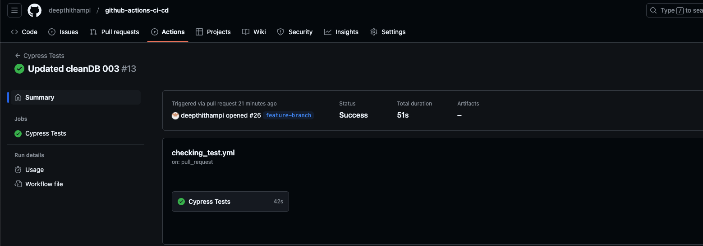
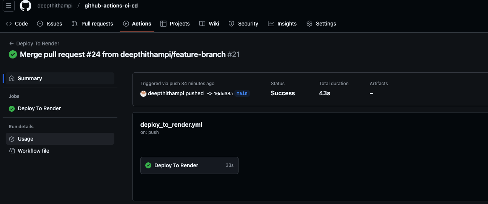

# Github-Actions-CI-CD

    
## Description
Github-Actions-CI-CD creates a CI/CD pipeline using GitHub Actions to run component testing via Cypress when a pull request is made to develop branch and the application is deployed when code is merged to main from develop.
    
## Table of Contents
- [Installation](#installation)
- [License](#license)
- [Contributing](#contributing)
- [Tests](#tests)
- [Questions](#questions)
- [Screenshots](#screenshots)
- [Deployed Link](#deployed-link)
    
## Installation
```
npm install and npm run start
```   

## License
This project is licensed under the MIT license.  
  
[More about MIT license](https://choosealicense.com/licenses/mit/)
    
    
## Contributing
Contributions are welcome!
    
## Tests
```
npm run test-component
```
    
## Questions
For any questions, please feel free to contact me at deepthi_thampi@hotmail. 
You can also find more of my work at [deepthithampi](https://github.com/deepthithampi).

## Screenshots



## Deployed Link 
(https://github-actions-ci-cd-qvj3.onrender.com)


